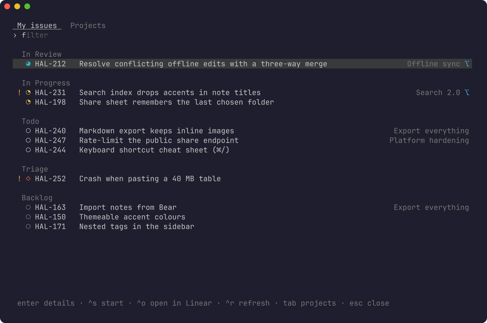
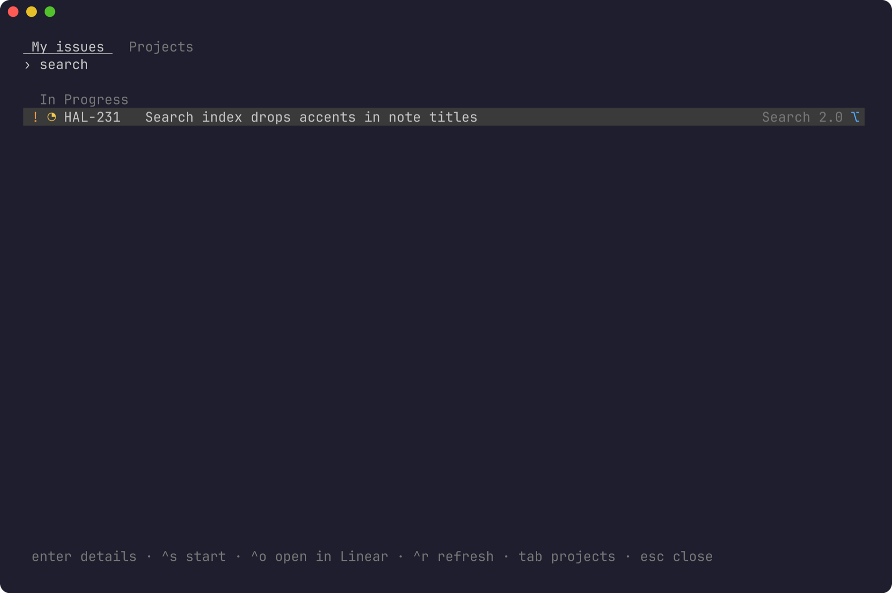
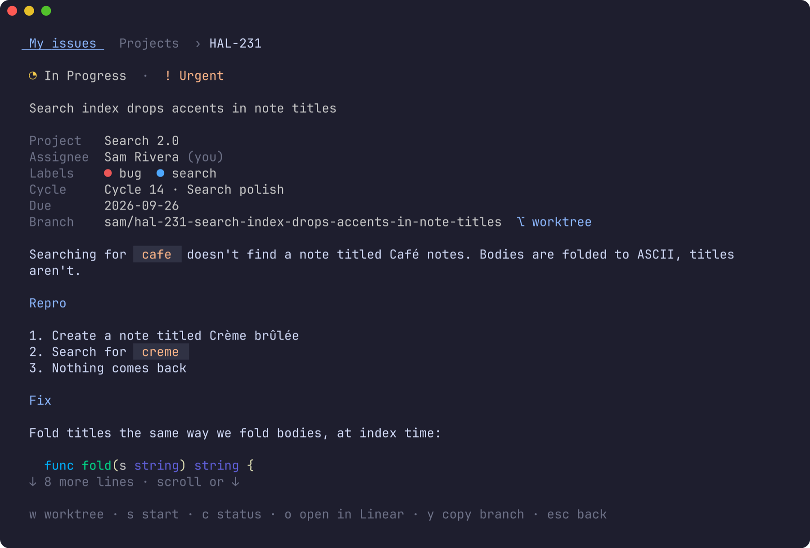
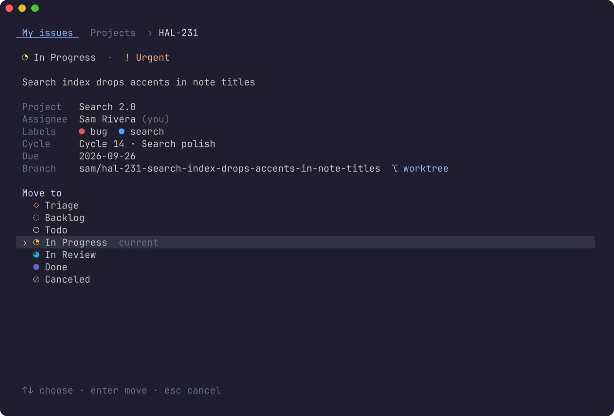
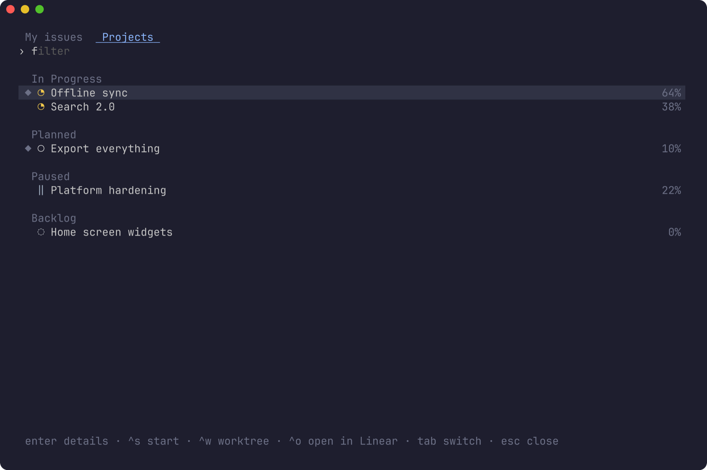
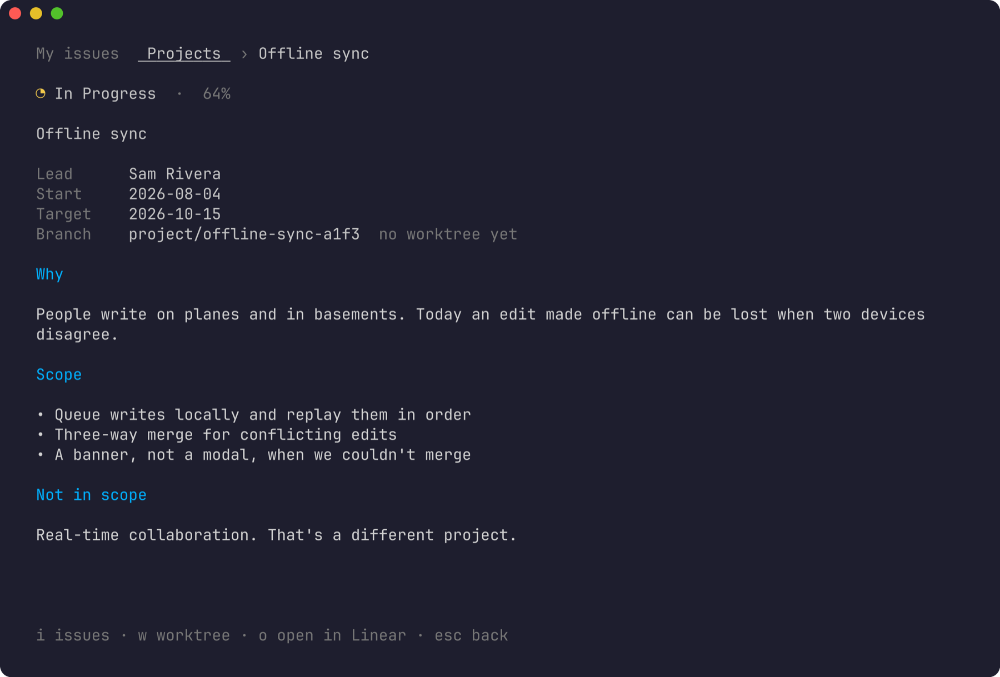
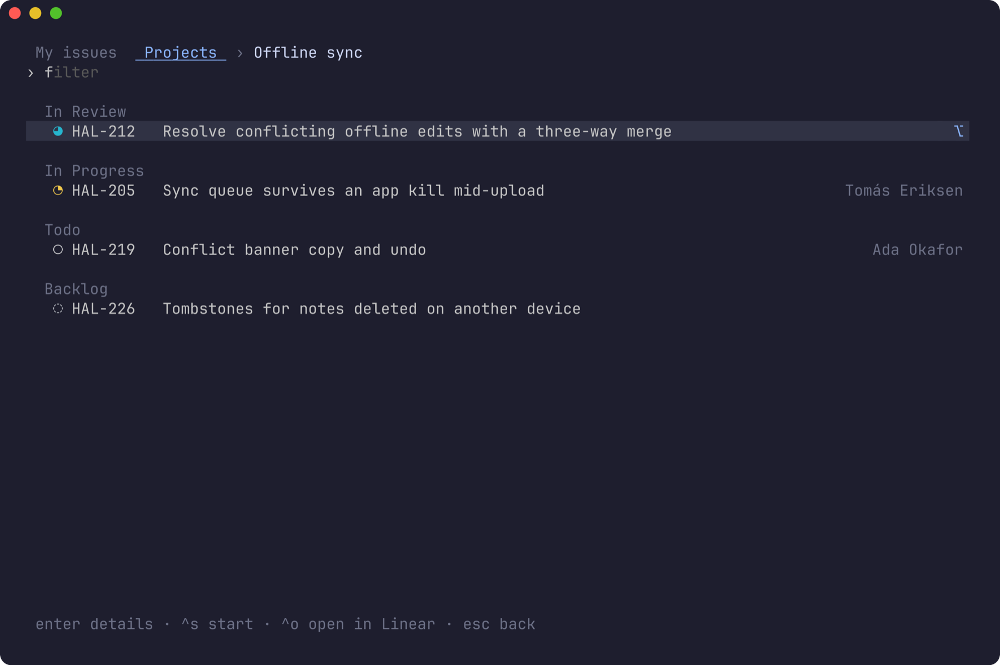

# herdr-linear

Your Linear issues and projects in a [herdr](https://herdr.dev) popup. See what
you're working on, read an issue, change its status, and land in a worktree for
it — created on Linear's own branch name if it doesn't exist yet — without
leaving the terminal. One more key starts the issue: In Progress, a fresh
worktree, and `/ticket ACT-123` typed into the agent that opens there.



- **My issues** grouped by status, with Linear's status icons in each state's
  own colour. Work in flight comes first, urgent issues are flagged, and a `⌥`
  marks issues that already have a worktree.
- **Issue screen**: status, priority, project, assignee, labels, cycle, due
  date, branch, and the description rendered as Markdown.
- **Change status** from the team's own workflow states.
- **Worktrees**: one key opens the issue's worktree, or creates it from a fresh
  `origin/main`.
- **Start** one of your issues (or an unassigned one): In Progress, yours,
  worktree created, and the new worktree's agent handed its first prompt.
- **Projects**: status, progress, lead, dates, content, their open issues, and
  a worktree per project.
- Keyboard first, and the mouse works: hover, click, scroll.
- In **herdr's theme colours**, whichever theme you've picked there.
- Signs in with **OAuth**. No API keys to paste; tokens live in the macOS
  keychain and refresh themselves.

**Contents:** [Requirements](#requirements) ·
[Install](#install) · [Try it without an account](#try-it-without-an-account) ·
[Sign in](#sign-in) · [Use](#use) · [Worktrees](#worktrees) ·
[Start](#start) · [Configuration](#configuration) ·
[Privacy and security](#privacy-and-security) · [Uninstall](#uninstall) ·
[Troubleshooting](#troubleshooting) · [How it works](#how-it-works) ·
[Development](#development)

## Requirements

- **herdr 0.9.0** or later.
- **macOS**. Tokens are stored in the macOS login keychain; Linux isn't
  supported yet.
- A **Linear** account.
- **Go 1.26.8+** to build from source; an older Go fetches 1.26.8 by itself
  (unless `GOTOOLCHAIN=local`, where it refuses to build rather than use a Go
  with known vulnerabilities). Optional: without Go, installing
  downloads a prebuilt binary for your Mac from the matching GitHub release,
  checked against the release's SHA-256 checksums.
- **git**, for worktrees.

## Install

```sh
herdr plugin install mrolafsson/herdr-linear
```

herdr clones the repo and runs `scripts/build.sh`, which builds
`bin/herdr-linear` with Go, or downloads the release binary if you don't have
Go. A downloaded binary is installed only if its SHA-256 matches the release's
`checksums.txt`.

The plugin adds three actions: **Linear: issues and projects**,
**Linear: demo**, and **Linear: sign out**. Plugins can't bind keys themselves,
so give the picker one in `~/.config/herdr/config.toml`:

```toml
[[keys.command]]
key = "prefix+shift+l"
type = "plugin_action"
command = "herdr-linear.open"
description = "Linear: issues and projects"
```

and reload:

```sh
herdr server reload-config
```

> Pick a key that's free. `prefix+l` is herdr's default for *focus pane
> right*, which is why the example uses `prefix+shift+l`.

You can also run any action without a key:

```sh
herdr plugin action invoke herdr-linear.open
```

### Install from a local checkout

```sh
git clone https://github.com/mrolafsson/herdr-linear
sh herdr-linear/scripts/build.sh
herdr plugin link "$PWD/herdr-linear"
```

After changing the code, run `scripts/build.sh` again; there's no need to
re-link.

## Try it without an account

**Linear: demo** opens the picker on *Halcyon*, a made-up notes-app company
with a team, five projects and a handful of issues. Everything works:
statuses change, issues start, worktrees get "created". Nothing is real: the
demo never contacts Linear, never reads the keychain, never runs git, and
never opens a browser. The footer says what the real plugin would have done.

```sh
herdr plugin action invoke herdr-linear.demo
# or, in any terminal:
bin/herdr-linear picker --demo
```

It's also how the screenshots in this README are made. See
[Screenshots](#screenshots).

## Sign in

Open the picker. The first time, it says Linear isn't connected yet:

1. Press **enter**. Your browser opens Linear's consent page for *herdr*.
2. Approve. The tab says you can close it.
3. The popup picks up on its own and loads your issues.

That's the only time you'll see it. Access tokens last 24 hours and refresh
automatically; if Linear ever revokes the grant, the picker simply offers to
sign in again.

From a terminal, the same flow and a couple of helpers:

```sh
bin/herdr-linear login            # browser sign-in
bin/herdr-linear status           # are you signed in, and until when
bin/herdr-linear logout           # revoke at Linear, then forget the tokens
bin/herdr-linear logout --local   # only forget them here, without revoking
```

Signing out only reports success once Linear has confirmed the access is
revoked. If Linear can't be reached, you stay signed in, so you can try again,
rather than being left with access you can no longer end from here.

What exactly is stored and sent is under
[Privacy and security](#privacy-and-security).

## Use

### My issues

Your open issues (anything not done or canceled), grouped by status, with work
in flight first: in review, then in progress, then todo, triage and backlog.
Within a group, higher priority comes first.

- The status icon is Linear's, in the state's colour: `◇` triage, `◌` backlog,
  `○` todo, `◔` in progress, `◕` in review: the circle fills up as the work
  moves along.
- `!` marks **urgent**.
- The project is on the right; `⌥` means the issue's worktree already exists.

**Type to filter.** Every word must match somewhere in the identifier, title,
status or project, so `search acc` finds *Search index drops accents*.



### An issue

Enter opens the issue.



At the top: status, priority, title, then project, assignee, labels, cycle, due
date and branch (with whether its worktree exists). Below that is the
description, rendered as Markdown: headings, lists, checkboxes, tables, quotes,
links, and code blocks with syntax highlighting. Long descriptions scroll.

| key                | does                                                        |
|--------------------|-------------------------------------------------------------|
| `w` or enter       | open the worktree, creating it if needed                    |
| `s`                | **start** the issue (see [Start](#start))                   |
| `c`                | change status                                               |
| `o`                | open in Linear                                              |
| `y`                | copy the branch name                                        |
| ↑ ↓, j k, PgUp PgDn, space | scroll the description                              |
| esc, ←             | back to the list                                            |

### Changing status

`c` lists the team's workflow states, in the order work flows through them,
each with its icon, and the current one marked.



Pick one with enter (or click it). The change is saved in Linear immediately
and the list updates without reloading. If Linear refuses, the old status stays
and the error is shown.

### Projects

Tab (or →) switches to projects: active projects, the ones you lead first
(`◆`), each with its status, how far along it is, and `⌥` if it has a
worktree.



Enter opens a project: status, progress, lead, start and target dates, its
branch, and its content rendered as Markdown.



| key          | does                                                   |
|--------------|--------------------------------------------------------|
| `i` or enter | the project's open issues, everyone's, not just yours  |
| `w`          | a worktree for the whole project                       |
| `o`          | open in Linear                                         |
| esc, ←       | back                                                   |



In a project's issue list, issues assigned to someone else show their name.

### All keys

In the list:

| key                  | does                                                   |
|----------------------|--------------------------------------------------------|
| typing               | filter                                                 |
| ↑ ↓, ctrl+p ctrl+n   | move                                                   |
| PgUp PgDn            | move a page                                            |
| enter                | open the issue or project                              |
| ctrl+s               | start the selected issue, straight from the list       |
| ctrl+w               | worktree for the selected project                      |
| ctrl+o               | open in Linear                                         |
| ctrl+r               | refresh                                                |
| tab, ← →             | switch between My issues and Projects                  |
| esc                  | clear the filter, then go back, then close             |
| ctrl+c               | close                                                  |

With text in the filter, ← and → move the cursor within it instead.

### Mouse

- **Hover** highlights a row; **one click** opens it.
- The **wheel** scrolls lists, descriptions and the status picker.
- The **tabs** and every **footer hint** are buttons: clicking `c status` is the
  same as pressing `c`. The hint under the pointer lights up.

The popup captures the mouse, so to select text in it hold **⌥** while
dragging.

## Worktrees

`w` (or enter on an issue) takes you to the issue's worktree, as its own herdr
space:

- **Already there?** It's opened and focused. The picker checks every worktree
  of the repo, so it finds it whichever space you're in.
- **Not yet?** It's created with `herdr worktree create`, on a new branch.

**Which repo.** The one the picker was opened from: the repo of the space you
were in. To open Linear from anywhere, map each Linear team to its checkout in
the [configuration](#configuration) (`"repos": {"ENG": "~/code/app"}`); the
mapping wins when present.

**Which branch.** Linear's own branch name for the issue, the one its *Copy
git branch name* gives you (the format is configurable in Linear), e.g.
`sam/eng-123-fix-the-thing`. Using it means Linear's GitHub
integration links the pull request to the issue automatically. Project
worktrees use `project/<the project's Linear slug>`.

**Starting from.** New branches start from the remote's default branch
(`origin/HEAD`, usually `origin/main`), fetched first so you never start from a
stale copy; offline, the local copy is used. Set `"base"` to change it. A branch
that already exists locally, say from a worktree you removed, is checked out
as it is.

If your herdr has a worktree template (for example with
[herdr-plus](https://github.com/cloudmanic/herdr-plus)), it runs as usual: the
plugin only asks herdr for the worktree, and everything else follows from that.

## Start

`s` on an issue (or ctrl+s in the list) does what you'd do by hand when picking
up a ticket. Start touches three things with no undo across them (Linear, git
and an agent), so the steps run in an order where a failure never leaves
something half-done behind your back:

1. **Check.** The issue is read again from Linear. If it's closed, or it's
   assigned to someone else, nothing happens and you're told why. Start is for
   your own and unassigned issues: on a coworker's it would put their work in
   progress and set your agent on it. (`w` opens a worktree for any issue.)
2. **Worktree.** Opened or created as in [Worktrees](#worktrees), from
   Linear's current copy of the issue (its branch may have changed), and
   focused. If that fails, Linear hasn't been touched.
3. **In Progress, and yours.** Making the worktree can take a while, so the
   issue is checked once more right before Linear is changed. Then it moves
   to the team's first "started" state (one already started, say In Review,
   keeps its state) and, if unassigned, is assigned to you.
4. **First prompt.** The plugin waits for an agent to start in the new
   worktree's own pane (your worktree template starts it), then types
   `/ticket ENG-123` into it and presses enter.

If a step after the worktree can't be done, the popup stays open and says what
did and didn't happen. That includes the issue's branch or team changing while
the worktree was being made: the prompt would then land in the wrong place, so
the issue isn't started.

About step 4:

- Only the new worktree's own pane is prompted, never another agent in the
  space, which could be in the middle of something else.
- It waits up to 90 seconds (`agent_wait_seconds`) for that agent to be ready
  for input. If it opens on a question first, such as Claude's *trust this
  folder?*, the plugin waits for you to answer it.
- It only prompts a **new** worktree. If the worktree already existed, its
  agent may be mid-task, so nothing is typed and a toast says so.
- No agent within the time limit means a toast asking you to run the prompt
  yourself.
- The prompt is configurable (`start_prompt`), with `{identifier}`, `{title}`
  and `{url}` filled in. `/ticket` suits a Claude Code skill of that name; use
  whatever your agent expects. Think twice before adding `{title}`: anyone in
  your workspace can write an issue title, and the agent will read it as part
  of its instructions.
- This part runs in the background after the popup closes. Its log,
  `kickoff.log` in `~/.local/state/herdr/plugins/herdr-linear/`, records what
  happened but not the prompt itself.

## Configuration

Everything is optional. Create `config.json` in the plugin's config directory:

```sh
herdr plugin config-dir herdr-linear
# usually ~/.config/herdr/plugins/config/herdr-linear
```

```json
{
  "repos": { "ENG": "~/code/app", "WEB": "~/code/website" },
  "base": "origin/main",
  "start_prompt": "/ticket {identifier}",
  "agent_wait_seconds": 90,
  "theme": "dark"
}
```

| key                  | default                    | what it does                                                                                     |
|----------------------|----------------------------|--------------------------------------------------------------------------------------------------|
| `repos`              | none                       | Linear team key → checkout. Used for that team's worktrees wherever you open the picker.         |
| `base`               | the remote's default branch | What new branches start from. Fetched first when it's a remote branch.                          |
| `start_prompt`       | `/ticket {identifier}`     | What **start** types into the new worktree's agent. `{identifier}`, `{title}`, `{url}` are filled in. See the note on `{title}` under [Start](#start). |
| `agent_wait_seconds` | `90`                       | How long **start** waits for that agent to be ready.                                             |
| `theme`              | asks the terminal          | `dark` or `light`, if the automatic choice is wrong: the base for rendered Markdown, and which of herdr's themes applies when herdr's `auto_switch` is on. |
| `client_id`          | this plugin's OAuth app    | Use your own Linear OAuth app instead; see below.                                                |

There's a copy of this in [`config.example.json`](config.example.json).

### Colours

The picker uses herdr's theme, read from herdr's own `config.toml`
(`$HERDR_CONFIG_PATH`, else `$XDG_CONFIG_HOME/herdr/config.toml`, else
`~/.config/herdr/config.toml`) each time it opens:

```toml
[theme]
name = "tokyo-night"      # or auto_switch = true, with dark_name / light_name

[theme.custom]            # and any token overrides
accent = "#f5c2e7"
```

It resolves the theme the way herdr does, aliases and fallbacks included, so a
name herdr doesn't know means herdr's default, catppuccin. The accent colours
tabs, hints, headings and the `⌥` marker; the selection, dim text, errors,
urgent flags, and Markdown text, inline code, links and quotes take their
tokens too (code blocks keep their syntax colours). A colour set to `reset` is
your terminal's own. Status icons and labels keep Linear's colours, so a state
looks the same here as in Linear. After changing herdr's theme, reopen the
picker.

Some cases where the picker's colours differ from herdr's:

- **A theme made for the other background.** herdr paints its own panels in the
  theme's background, but the picker draws on your terminal's, so with a light
  theme in a dark terminal (or the reverse) the picker keeps its own colours
  rather than draw dark text on dark. With herdr's `auto_switch`, the theme
  always fits.
- **The wrong light or dark guess.** With `auto_switch`, the picker asks the
  terminal whether it's dark or light. If it guesses wrong, set `"theme"` in
  the plugin's config (above).
- **A broken `config.toml`.** herdr keeps its last good theme when a reload
  fails; the picker can only read the file, so it shows herdr's defaults until
  the file is fixed. `herdr config check` points at the problem.

## Privacy and security

**What leaves your machine.** Requests go to Linear only: `linear.app` for
sign-in and `api.linear.app` for data. There's no other server, no analytics,
and no telemetry. The **start** prompt goes to the agent in your own terminal.

**What's read.** Your assigned issues, active projects and their issues, and
the details of whatever you open: descriptions, labels, cycles, workflow
states. **What's written:** an issue's status, and its assignee when **start**
claims an unowned issue. Nothing else is ever changed.

**Sign-in.** OAuth 2.0 authorization code flow with PKCE (S256):

- The plugin is a *public* client: it has no client secret, so there's none to
  leak.
- Scopes: `read,write`. Write is used only for the two changes above.
- The callback is `http://localhost:47821/callback`, served only on the
  loopback interface for the few seconds the sign-in takes. A random `state`
  value is checked, so any request that isn't from this sign-in is refused.
- If you close the popup mid-sign-in, the listener stops with it.

**Tokens.** Stored in your macOS **login keychain** as a generic password
(service `herdr-linear`, account `oauth`). They're written through `security`'s
stdin, never on a command line where other processes could see them. Access
tokens last 24 hours and refresh automatically; each refresh replaces the
refresh token too. Every change to the stored tokens (refresh, sign-in,
sign-out) takes the same lock, shared by all herdr-linear processes, so two
popups never spend the same refresh token and a refresh can't sign you back
in after you've signed out. Nothing is written to disk in plain text.

What the keychain does and doesn't protect: the item is created by macOS's
`security` tool, so it's the `security` tool the keychain trusts to read it,
not this plugin. Any program running as you can therefore read it with
`security find-generic-password` without a prompt. That's the same protection
as most command-line tools that keep tokens in the keychain (including those
using Go's go-keyring), and it's better than a plain file: it's encrypted at
rest and not in any backup or dotfile. It won't stop malware already running
as you. Sign out, or revoke *herdr* in Linear, to end access for sure.

**Revoking.** **Linear: sign out** (or `bin/herdr-linear logout`) revokes the
grant at Linear, then deletes the keychain item; see [Sign in](#sign-in) for
what happens when Linear can't be reached. You can also revoke *herdr* from
Linear's account settings, where it's listed among your authorized
applications.

**Text from Linear.** Issue titles, descriptions, names and labels are written
by other people, so every string from Linear has terminal escape sequences and
control characters removed before anything is shown. A title can't rewrite
your clipboard, retitle your terminal or fake what's on screen. "Open in
Linear" only opens `https` links on `linear.app`.

**Your own OAuth app.** To use an OAuth app you control, create one in Linear
(Settings → API → OAuth applications) with the callback URL
`http://localhost:47821/callback`, and put its client ID in `config.json` as
`client_id`. No secret is needed.

## Uninstall

```sh
herdr plugin action invoke herdr-linear.logout   # revokes access at Linear
herdr plugin uninstall herdr-linear
```

Then remove the key binding from `~/.config/herdr/config.toml`. If you uninstall
first, delete the keychain item by hand:

```sh
security delete-generic-password -s herdr-linear -a oauth
```

and, optionally, the plugin's config and state:
`~/.config/herdr/plugins/config/herdr-linear` and
`~/.local/state/herdr/plugins/herdr-linear`.

## Troubleshooting

**The key does nothing.** Check it's actually free, since herdr uses many
prefix keys itself; `prefix+l` is *focus pane right*. Then run
`herdr server reload-config`. `herdr plugin action invoke herdr-linear.open`
tells you whether the plugin itself works.

**"Not signed out: couldn't revoke access at Linear".** Linear couldn't be
reached, or refused, or wouldn't refresh an expired sign-in (which happens if
you changed `client_id` since signing in). You're still signed in, on purpose;
try again when you're online. To only forget the tokens on this Mac, run
`bin/herdr-linear logout --local`, then revoke *herdr* in Linear's settings.

**"showing the first 1000".** A list stopped at 1,000 items rather than loading
without end. Filter to narrow it, or open Linear for the rest.

**"… so it wasn't started".** The issue is closed, or assigned to someone
else, in Linear right now, perhaps since you loaded the picker. Nothing was
changed; press ctrl+r to see its current state. To work on a coworker's issue
anyway, `w` opens its worktree without starting it.

**"didn't page through to the end".** Linear's paging stopped moving
mid-list, so it may be missing items. Press ctrl+r to try again.

**"busy updating your Linear sign-in".** Another herdr-linear process held the
sign-in lock for more than 15 seconds, perhaps waiting on a slow Linear. Try
again in a moment.

**It's not in my command palette.** Some palette plugins list other plugins'
actions with a flag that herdr 0.9.1 doesn't accept, so they show none at all.
The key binding and `herdr plugin action invoke` still work.

**"can't listen on port 47821".** Another sign-in is still waiting, perhaps in
another popup or terminal. Close it, or wait for it to time out (5 minutes).

**Sign-in fails with a keychain error.** The tokens couldn't be saved to the
login keychain. Check that it's unlocked (Keychain Access → login), then sign
in again. `bin/herdr-linear status` shows what's stored.

**"no repo for team …".** You opened the picker from a space that isn't inside
that team's repo, and there's no mapping for it. Open it from the repo, or add
the team under `repos`.

**The agent didn't get `/ticket`.** Look at `kickoff.log` (see [Start](#start)).
The usual causes: the worktree already existed (by design), no agent is started
in new worktrees, or it took longer than `agent_wait_seconds`.

**Colours look wrong in descriptions.** Set `"theme": "dark"` or `"light"`.
If the picker's colours don't match herdr's, check that herdr's config is
where the picker looks (see [Colours](#colours)); `herdr config check` shows
whether herdr itself read your theme.

**The popup opens and closes at once.** Look for the error in
`herdr plugin log list --plugin herdr-linear`, and rebuild with
`scripts/build.sh`.

## How it works

herdr plugins are commands plus popups. **Linear: issues and projects** runs
`herdr-linear action open`, which reads the invoking space from herdr's
context and opens the plugin's `picker` pane as a popup. That popup is the
same binary running a [Bubble Tea](https://github.com/charmbracelet/bubbletea)
interface.

- **Linear**: GraphQL over HTTPS with the OAuth access token. It uses one query
  per screen and caches nothing between popups, so what you see is current.
- **herdr**: its local socket API: `worktree.list`, `worktree.create` and
  `worktree.open` for worktrees, `plugin.pane.open` for the popup, and
  `pane.list` plus `agent.prompt` for the start hand-off.
- **Start** spawns a detached `herdr-linear kickoff`, so the popup can close
  while it waits for the new agent.

| file            | what's in it                                             |
|-----------------|----------------------------------------------------------|
| `main.go`       | commands and actions                                     |
| `auth.go`       | OAuth + PKCE, keychain storage, refresh, sign-out        |
| `linear.go`     | GraphQL queries and mutations                            |
| `herdr.go`      | herdr socket client                                      |
| `worktree.go`   | repo and branch choice, worktree open/create, kickoff    |
| `tui.go`        | the list, tabs, filter and layout                        |
| `detail.go`     | issue and project screens, status picker                 |
| `markdown.go`   | Markdown rendering and scrolling                         |
| `mouse.go`      | hover, clicks, wheel                                     |
| `demo.go`       | the fictional demo workspace                             |

## Development

```sh
sh scripts/build.sh                 # build bin/herdr-linear
go test ./...                       # the suite
bin/herdr-linear picker --demo      # run the picker in any terminal
```

The tests cover sign-in end to end over a real loopback callback, token
refresh and rotation, the GraphQL client against a fake server, every screen
and key, mouse hit-testing measured against the rendered screen, Markdown
rendering, and the demo, including a check that no demo screen shows anything
from a real workspace.

### Screenshots

Every image here comes from the demo workspace, so no real issue or project can
end up in the README.

```sh
brew install charmbracelet/tap/freeze
sh scripts/screenshots.sh           # rewrites docs/images/
```

A test (`TestWriteDemoScreens`, skipped in normal runs) drives the demo picker
through each screen and saves exactly what it draws. [freeze](https://github.com/charmbracelet/freeze)
turns those into PNGs. Change what's shown in [`screens_test.go`](screens_test.go);
the demo's data is in [`demo.go`](demo.go).

### Releasing

1. Bump `version` in `herdr-plugin.toml` and move the `CHANGELOG.md` entry out
   of *unreleased*.
2. Commit, then tag the same version: `git tag v0.2.0 && git push --tags`.

The release workflow checks that the tag matches the manifest, runs the tests,
and publishes macOS binaries (arm64 and amd64) with GoReleaser. Those binaries
are what `scripts/build.sh` downloads on machines without Go.

## License

MIT. See [LICENSE](LICENSE).
